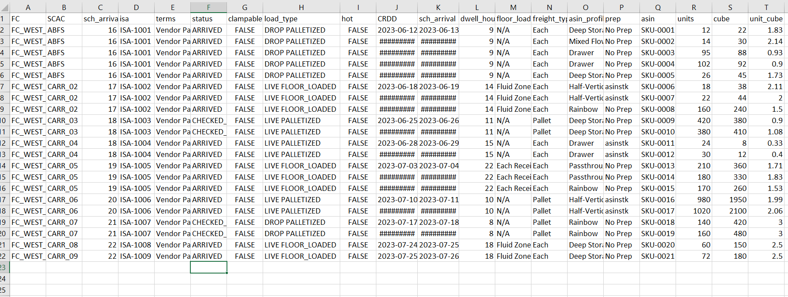
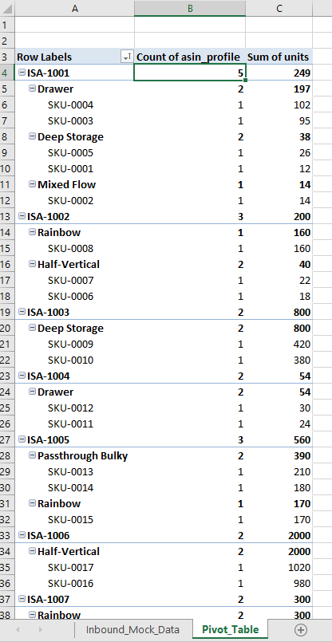
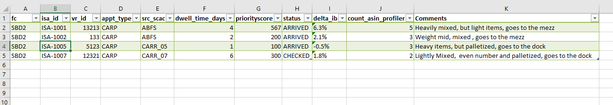

# Inbound Warehouse Data Analysis

## 📌 Project Overview
This project focuses on organizing inbound warehouse data using Excel to determine **which trailers should be routed to each department** based on how their items are structured.

In the operation, trailers with **fewer, more uniform items** can be processed faster at the **dock**, where items are palletized quickly.  
In contrast, trailers with **highly mixed items** are routed to the **mezzanine (mezz)**, where items are processed one by one.

The challenge is that inbound trailers arrive **disorganized**, containing many different items, making routing decisions unclear without proper analysis.

---

## 📊 Raw Data – Inbound Trailers (Unorganized)

### Raw Data Sample

This raw dataset represents **multiple inbound trailers**, each containing **many different items (ASINs)**.

Key characteristics of the raw data:
- Each trailer includes multiple SKUs and ASIN profiles
- Items are mixed, unsorted, and include past and future inbound trailers
- At this stage, it is **not clear** which trailers should go to the dock or the mezz

Because the data is **flat and unorganized**, it is difficult to make routing decisions directly.  
This is why a **pivot table analysis is required**.

---

## 📈 Pivot Table Analysis – Trailer Organization

### Pivot Table Overview

The pivot table restructures the raw data to provide a **clear trailer-level view**.

What the pivot table does:
- Groups data by **ISA (trailer)**
- Counts the number of **different ASIN profiles** per trailer
- Aggregates **total units** per trailer
- Breaks down each trailer by department (Drawer, Deep Storage, Rainbow, etc.)

This analysis is critical because:
- **Trailers with fewer ASIN profiles** are easier and faster to process
- These trailers are strong candidates to go to the **dock**
- Trailers with many mixed ASIN profiles are better suited for the **mezz**

This section demonstrates:
- Strong **pivot table skills**
- Ability to organize and summarize complex operational data
- Translating raw inbound data into **actionable routing insights**

---

## 📊 Trailer Summary – Operational Decision View

### Trailer Summary (Routing / KPI-like view)

This final section represents a **live operational decision view**.

Here, all available inbound trailers are summarized so the team can:
- Quickly see **which trailers are available outside**
- Identify how many **different items** each trailer contains
- Decide **which trailer is best for the dock or the mezz**

Using **XLOOKUP**, the number of different ASIN profiles from the pivot table is pulled into this summary view.  
This allows for:
- Fast comparison between trailers
- Immediate routing decisions
- Reduced decision time for inbound teams

This step connects:
- Raw data → Pivot table analysis → Operational execution

---

## 🛠️ Tools Used
- Microsoft Excel  
  - Pivot Tables  
  - XLOOKUP  
  - Data aggregation and summarization  

---

## 🧠 Key Insight
By organizing inbound trailer data and identifying how many different items each trailer contains, routing decisions become faster, clearer, and more efficient—ensuring the right trailers are sent to the dock for fast palletization and mixed trailers are routed to the mezz for individual processing.
